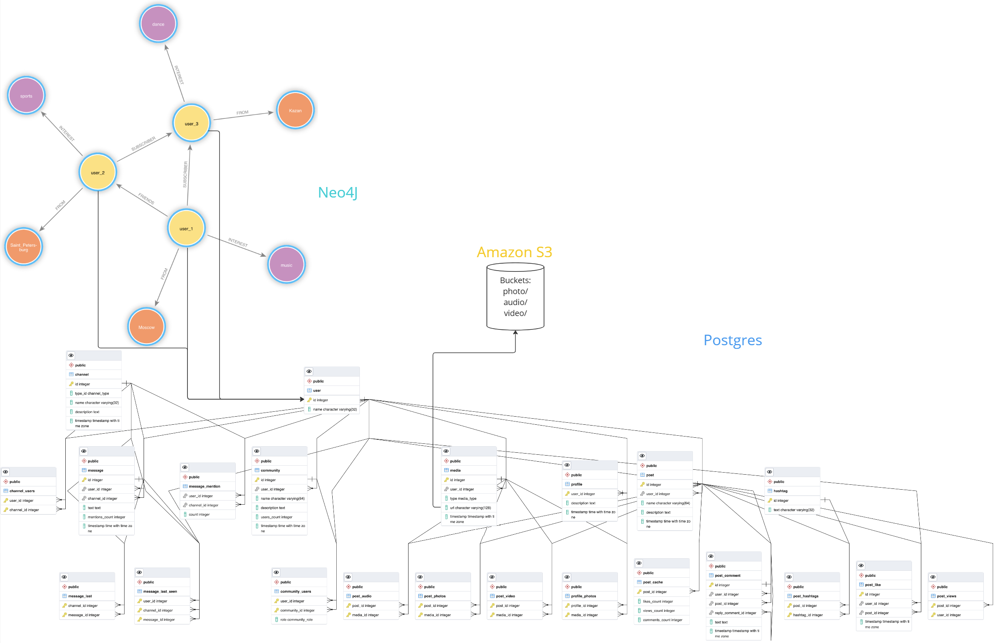

# System Design (ВКонтакте)

## Задача:
Спроектировать базу(ы) данных для социальной сети ВКонтакте:
* анкеты людей (имя, описание, фото, город, интересы, ...)
* посты (описание, фото / видео / аудио, хэштеги, лайки, просмотры, комментарии ...)
* личные сообщения и чаты (текст, прочитанность сообщений)
* отношения (друзья, подписчики)
* сообщества (люди, посты)
* медиа (фото, аудио, видео)

## Сокращения:
* RT (response time) - время отклика
* DAU (daily active users) - активные пользователи за день
* MAU (monthly active users) - активные пользователи за месяц
* RPS (records per second) - записей в секунду
* RPD (records per day) - записей в день
* RPM (records per month) - записей в месяц
* 86.400 = (24(hours)*60(mins)*60(secs))

## Общие
### Функциональные требования:
1) Кросс-девайсная синхронизация

### Нефункциональные требования:
1) DAU – 53 млн
2) MAU - 87 млн
3) Availability 99.95% = 5 часов в год
4) Безопасность
5) Геораспределение
6) Eventual consistency

## Посты
### Функциональные требования:
1) Неограниченное кол-во постов
2) Создание/редактирование/возможность удаления постов
3) Посты отображаются в обратном порядке.
4) Поддержка комментариев и лайков в постах
5) Просмотр сообщений, комментариев, лайков и просмотров
6) Текст и медиа (фото, видео, аудио)
7) Уведомления
8) Репосты
9) Хранение до 10 лет

### Нефункциональные требования:
1) Макс размер текста - 1.000 символов
2) Бесконечная лента
3) 10 штук в пагинации
4) Кол-во комментариев неограниченно
5) Размер комментария - 100 символов
4) Среднее количество комментариев под постом - 3 штуки
6) Среднее количество чтений постов в день - 5 штук
7) Среднее количество постов в день - 1 штука
8) RT на запись - 3 сек
9) RT на чтение ленты — 2 сек
10) Макс 5 фото (каждое до 1 МБ), макс 3 аудио (каждое до 5 МБ), макс 1 видео (каждое до 10 МБ)

### Нагрузка:
* Second:
```
RPS write = 53.000.000 (DAU) * 1 (user writes posts) / 86.400 ≈ 660
RPS read = 53.000.000 (DAU) * 5 (user reads posts) / 86.400 ≈ 3.300
Ceph RPS write = (5 MB (images) + 15 MB (audio) + 10 MB (video)) * 660 = 19.800 MB ≈ 20 GB
Ceph RPS read = (5 MB (images) + 15 MB (audio) + 10 MB (video)) * 3.300 = 99.000 MB ≈ 100 GB
Postgres RPS write = (2.000 (1000 text symbols * 2 UTF) + 600 (300 comments symbols * 2 UTF)) * 660 = 1.716.000 B = 1.716 KB ≈ 2 MB
Postgres RPS read = (2.000 (1000 text symbols * 2 UTF) + 600 (300 comments symbols * 2 UTF)) * 3.300 = 8.580.000 B = 8.580 KB ≈ 8.5 MB
```
* Day:
```
RPD write = 53.000.00 (DAU) * 1 (user writes posts) ≈ 53.000.000
RPD read = 53.000.00 (DAU) * 5 (user reads posts) ≈ 265.000.000
Ceph RPS write = (5 MB (images) + 15 MB (audio) + 10 MB (video)) * 53.000.000 = 1.590.000.000 MB = 1.590.000 GB = 1.590 TB ≈ 1.6 PB
Ceph RPS read = (5 MB (images) + 15 MB (audio) + 10 MB (video)) * 265.000.000 = 7.950.000.000 MB = 7.950.000 GB = 7.950 TB ≈ 8 PB
Postgres RPD write = (2.000 (1000 text symbols * 2 UTF) + 600 (300 comments symbols * 2 UTF)) * 53.000.000 = 137.800.000.000 B = 137.800.000 KB = 137.800 MB ≈ 138 GB
Postgres RPD read = (2.000 (1000 text symbols * 2 UTF) + 600 (300 comments symbols * 2 UTF)) * 265.000.000 = 689.000.000.000 B = 689.000.000 KB = 689.000 MB ≈ 700 GB
```
* Month:
```
RPM write = 87.000.000 (MAU) * 1 (user writes posts) * 30 (days) ≈ 2.610.000.000
RPM read = 87.000.000 (MAU) * 5 (user reads posts) * 30 (days) ≈ 13.050.000.000
Ceph RPM write = (5 MB (images) + 15 MB (audio) + 10 MB (video)) * 2.610.000.000 = 78.300.000.000 MB = 78.300.000 GB = 78.300 TB ≈ 78 PB
Ceph RPM read = (5 MB (images) + 15 MB (audio) + 10 MB (video)) * 13.050.000.000 = 391.500.000.000 MB = 391.500.000 GB = 391.500 TB ≈ 391 PB
Postgres RPM write = (2.000 (1000 text symbols * 2 UTF) + 600 (300 comments symbols * 2 UTF)) * 2.610.000.000 = 6.786.000.000.000 B = 6.786.000.000.000 KB = 6.786.000 MB = 6.786 GB ≈ 7 TB
Postgres RPM read = (2.000 (1000 text symbols * 2 UTF) + 600 (300 comments symbols * 2 UTF)) * 13.050.000.000 = 33.930.000.000.000 B = 33.930.000.000 KB = 33.930.000 MB = 33.930 GB ≈ 34 TB
```

## Профиль
### Функциональные требования:
1) Имя
2) Описание
3) Статус (online/offline)
4) Фото
5) Город
6) Интересы
7) Друзья и подписчики
8) Запрос дружбы (подписка)

### Нефункциональные требования:
1) Фото (до 1 МБ)
2) Имя, город, интересы, описание - 1.000 символов
2) Нет ограничений на кол-во друзей и подписчиков
3) Среднее кол-во друзей — 100
4) Среднее кол-во подписчиков — 200
5) RT на создание профиля пользователя – 3 сек
6) RT на чтение профиля пользователя – 2 сек
8) В среднем новых пользователей в день - 50.000
9) В среднем на страницу заходят 2 человека

### Нагрузка:
* Second:
```
RPS write = 50.000 (create profiles) / 86.400 ≈ 0,6
RPS read = 53.000.00 (DAU) * 2 (users read profile) / 86.400 ≈ 1.227
Ceph RPS write = 1 MB (image) * 0,6 = 0,6 MB ≈ 600 KB
Ceph RPS read = 1 MB (image) * 1.227 = 1.227 MB ≈ 1 GB
Postgres RPS write = 2.000 (1000 text symbols * 2 UTF) * 0,6 = 1.200 B ≈ 1 KB
Postgres RPS read = 2.000 (1000 text symbols * 2 UTF) * 1.227 = 2.454.000 B = 2.454 KB ≈ 2MB
```
* Day:
```
RPD write = 50.000 (create profiles) ≈ 50.000
RPD read = 53.000.00 (DAU) * 2 (users read profile) ≈ 106.000.000
Ceph RPD write = 1 MB (image) * 50.000 = 50.000 MB ≈ 50 GB
Ceph RPD read = 1 MB (image) * 106.000.000 = 106.000.000 MB = 106.000 GB ≈ 106 TB
Postgres RPD write = 2.000 (1000 text symbols * 2 UTF) * 50.000 = 100.000.000 B = 100.000 KB ≈ 100 MB
Postgres RPD read = 2.000 (1000 text symbols * 2 UTF) * 106.000.000 = 212.000.000.000 B = 212.000.000 KB = 212.000 MB ≈ 212 GB
```
* Month:
```
RPM write = 50.000 (create profiles) * 30 (days) ≈ 1.500.000
RPM read = 87.000.00 (MAU) * 2 (users read profile) * 30 (days) ≈ 5.220.000.000
Ceph RPM write = 1 MB (image) * 1.500.000 = 1.500.000 MB = 1.500 GB ≈ 2 TB
Ceph RPM read = 1 MB (image) * 5.220.000.000 = 5.220.000.000 MB = 5.220.000 GB = 5.220 TB ≈ 5 PB
Postgres RPM write = 2.000 (1000 text symbols * 2 UTF) * 1.500.000 = 3.000.000.000 B = 3.000.000 KB = 3.000 MB ≈ 3 GB
Postgres RPM read = 2.000 (1000 text symbols * 2 UTF) * 5.220.000.000 = 10.440.000.000.000 B = 10.440.000.000 KB = 10.440.000 MB = 10.440 GB ≈ 10 TB
```

## Сообщества
### Функциональные требования:
1) Описание
2) Открытые/закрытые
3) Просмотр пользователей
4) Роли пользователей
5) Запрос на вступление от пользователя (подписка)
6) Приглашение пользователя на вступление
7) Уведомления

### Нефункциональные требования:
1) 10 постов в пагинации
2) Ограничение кол-ва пользователей до 1.000.000
3) Среднее кол-во постов в день - 50 штук
4) Среднее количество чтений постов в день - 10 штук

### Нагрузка:
* Second:
```
RPS write = 50 (users write posts) / 86.400 ≈ 0,0006
RPS read = 1.000.000 * 10 (users read posts) / 86.400 ≈ 115
Ceph RPS write = (5 MB (images) + 15 MB (audio) + 10 MB (video)) * 0,0006 = 0,018 MB ≈ 18 KB
Ceph RPS read = (5 MB (images) + 15 MB (audio) + 10 MB (video)) * 115 = 3.450 MB ≈ 3 GB
Postgres RPS write = (2.000 (1000 text symbols * 2 UTF) + 600 (300 comments symbols * 2 UTF)) * 0,0006 ≈ 1,56 B
Postgres RPS read = (2.000 (1000 text symbols * 2 UTF) + 600 (300 comments symbols * 2 UTF)) * 115 = 299.000 B ≈ 300 KB
```
* Day:
```
RPD write = 50 (users write posts) ≈ 50
RPD read = 1.000.000 * 10 (users read posts) ≈ 10.000.000
Ceph RPD write = (5 MB (images) + 15 MB (audio) + 10 MB (video)) * 50 = 1.500 MB ≈ 1.5 GB
Ceph RPD read = (5 MB (images) + 15 MB (audio) + 10 MB (video)) * 10.000.000 = 300.000.000 MB = 300.000 GB ≈ 300 TB
Postgres RPD write = (2.000 (1000 text symbols * 2 UTF) + 600 (300 comments symbols * 2 UTF)) * 50 = 130.000 B ≈ 130 KB
Postgres RPD read = (2.000 (1000 text symbols * 2 UTF) + 600 (300 comments symbols * 2 UTF)) * 10.000.000 = 26.000.000.000 B = 26.000.000 KB = 26.000 MB ≈ 26 GB
```
* Month:
```
RPM write = 50 (users write posts) * 30 (days) ≈ 1.500
RPM read = 1.000.000 * 10 (users read posts) * 30 (days) ≈ 300.000.000
Ceph RPM write = (5 MB (images) + 15 MB (audio) + 10 MB (video)) * 1.500 = 45.000 MB ≈ 45 GB
Ceph RPM read = (5 MB (images) + 15 MB (audio) + 10 MB (video)) * 300.000.000 = 9.000.000.000 MB = 9.000.000 GB = 9.000 TB ≈ 9 PB
Postgres RPM write = (2.000 (1000 text symbols * 2 UTF) + 600 (300 comments symbols * 2 UTF)) * 1.500 = 3.900.000 B = 3.900 KB ≈ 4 MB
Postgres RPM read = (2.000 (1000 text symbols * 2 UTF) + 600 (300 comments symbols * 2 UTF)) * 300.000.000 = 780.000.000.000 B = 780.000.000 KB = 780.000 MB ≈ 780 GB
```
## Чаты
### Функциональные требования:
1) Бесконечная прокрутка
2) Создание/редактирование/удаление сообщения
3) Статусы сообщения (отправленность/прочитанность)
4) Оповещения
5) Репост сообщения

### Нефункциональные требования:
1) Неограниченное кол-во сообщений
2) Сообщения не удаляются
3) Кол-во сообщений в пагинации - 10 штук
4) Размер сообщения - 300 символов
5) Среднее количество чтений сообщений в день - 50 штук
6) Среднее количество сообщений в день - 10 штук
7) RT на запись сообщения - 1 сек
8) RT на получение сообщения — 2 сек
9) RT на чтение пагинации сообщений — 3 сек

### Нагрузка:
* Second:
```
RPS write = 53.000.000 (DAU) * 10 (user writes messages) / 86.400 ≈ 6.134
RPS read = 53.000.000 (DAU) * 50 (user reads messages) / 86.400 ≈ 30.671
Postgres RPS write = 600 (300 text symbols * 2 UTF) * 6.134 = 3.680.400 B = 3.680 KB ≈ 4 MB
Postgres RPS read = 600 (300 text symbols * 2 UTF) * 30.671 = 18.402.600 B = 18.403 KB ≈ 18 MB
```
* Day:
```
RPD write = 53.000.00 (DAU) * 10 (user writes messages) ≈ 530.000.000
RPD read = 53.000.00 (DAU) * 50 (user reads messages) ≈ 2.650.000.000
Postgres RPD write = 600 (300 text symbols * 2 UTF) * 530.000.000 = 318.000.000.000 B = 318.000.000 KB = 318.000 MB ≈ 320 GB
Postgres RPD read = 600 (300 text symbols * 2 UTF) * 2.650.000.000 = 1.590.000.000.000 B = 1.590.000.000 KB = 1.590.000 MB = 1.590 GB ≈ 2 TB
```
* Month:
```
RPM write = 87.000.000 (MAU) * 10 (user writes messages) * 30 (days) ≈ 26.100.000.000
RPM read = 87.000.000 (MAU) * 50 (user reads messages) * 30 (days) ≈ 130.500.000.000
Postgres RPM write = 600 (300 text symbols * 2 UTF) * 26.100.000.000 = 15.660.000.000.000 B = 15.660.000.000 KB = 15.660.000 MB = 15.660 GB ≈ 16 TB
Postgres RPM read = 600 (300 text symbols * 2 UTF) * 130.500.000.000 = 78.300.000.000.000 B = 78.300.000.000 KB = 78.300.000 MB = 78.300 GB ≈ 78 TB
```
<p align="center">
    <br><b>Схема взаимодействия БД</b></br>
</p>

<p align="center">
  <br></br>
</p>

<p align="center">
    <br><b>Общая схема</b></br>
</p>

<p align="center">
  <br></br>
</p>

## Комментарии к схеме
### Client
Кросс-девайсная синхронизация: ноутбук, телефон

### GeoDNS
Используется для геораспределения. Используются репликации master-master для всех БД. Синхронизация будет происходить раз в час между БД (на схеме связи не отображены, чтобы не нагромождать!!!). Для медиа (изображения, аудио, видео) используется БД - Ceph одна для всех ЦОД.

### CDN
Для регионов можно кэшировать медиа (картинки, видео, аудио) с помощью CDN под каждый отдельный регион. Тип CDN - PoP (point of presence) – точка присутствия вспомогательных серверов. Clinetы ходят за медиа через CDN. Если у CDN нет такого медиа, то он берет из Ceph и кэширует у себя.
Availability: в случае отказа датацентра (ЦОД) одного региона, то нагрузка будет распределена между другими датацентрами других регионов, т.е. будет увеличена.
Если чтение в ЦОДе выходит из строя, то запись продолжает работать. Если запись выходит из строя, то некоторые сервисы чтения будут работать. Это достигается с помощью CQRS (разделение на сервисы: чтение/запись).

### Nginx (POST)
Нужен для записи.

### Nginx (PUT)
Нужен для обновления.

### Nginx (GET)
Нужен для чтения.

### API (POST)
Client создает данные, API передает данные в сервисы и параллельно кладет в Kafka (POST) для уповещения других Clientoв об этом.
Здесь происходит авторизация Clienta. Можно сделать каскад, где можно пойти не в один в микросервис, а в несколько, чтобы у каждого микросервиса была единственная зона ответственности. API добавляет единую точку отказа, если он падает, то все связанные с ним микросервиса становятся недоступны.

### API (GET)
Client получает данные.

### Notification
Выступает в роли consumer.
Client получает уведомления об изменении/обновлении данных.
Подписан на Kafka (PUT) и ходит к нему с определенным интервалом, чтобы узнавать пришли обновления или нет. При отправки обновления нужно разослать другим clientам по вебсокету. Есть 2 способа: Poling и Long Poling. Для отправки данных нужен ближайший доступный сервер для каждого clienta. Для каждого оннлайн пользователя нужно хранить отдельный connection для вебсокета – это использование отдельной памяти, поэтому нужен Client Status сервер. Notifier ходит с определенным интервалом в Client Status и узнает в оннлайне/неоннлайне пользователь по открытому вебсокету. Для каждого неоннлайн пользователя данные записываются в сервис 3Party.

### Client Status (Online)
Держит соединение с online clientами по вебсокету. Nginx шлет о состоянии пользователя Heartbit с определенным интервалом в Client Status. В Tarantool хранится map id пользователя с connection по вебсокету, достигается за счет балансировщика Sticky sessions.
<br>
БД: Tarantool.
<br>
Шардирование: user_id.
<br>
Репликация: Master-slave, гео-репликация не нужна.


### 3Party (Offline)
Каждого offline clientа Notification данные вместе c id пользователем записываются в сервис 3Party. Когда client появлятся в onnline, он получает данные.

### Smart Sharder
Балансировка БД сервисов для шардирования данных на основе статистики и прогнозирования.
Во время записи данных нужно определиться, где какие данные нужно хранить, поэтому нельзя в момент записи выполнять балансировку. Данные должны заранее быть раскинуты, это не stateless сервис.
В Zookeeper хранится конфигурация: какой пост/сообщество/пользователь/профиль/чат на каком шарде находится.
<br>
БД: Zookeeper.
<br>
Шардирование: нет.
<br>
Репликация: Master-slave.

### Kafka
На сервисы Post и Message самая большая нагрузка, поэтому для них выделяется отдельная Kafka: Post Broker и Message Broker.

### Kafka (POST)
Очередь для обновления и получения данных. Feed забирает данные из Kafka (POST). 
<br>
Топики: Media, Hashtag, Like, Comment, Community, User, Profile, Relationship, Celebrity, Channel.
<br>
Партиционирование: Smart Sharder.

### Kafka (PUT)
Очедедь для обновления.
<br>
Топики: Media, Hashtag, Like, Comment, Post, Community, User, Profile, Relationship, Celebrity, Channel, Message.
<br>
Партиционирование: Smart Sharder.

### Kafka (Message Broker)
Выступает в роли producer.
Client в чате отправляет сообщение, помимо него 100 clientов в этом чате, из них 50 оннлайн. Для этого нужна очередь. Message сервис записвывает сообщение в очередь с id пользователей в Message Broker для дальнейшей рассылки. 
<br>
Партиционирование: channel_id.

### Kafka (Post Broker)
Выступает в роли producer.
Client создает пост, теперь нужно отправить этот пост в ленту, тем кто на него подписан. Для этого нужна очередь. Post сервис записывает пост в очередь с id пользователей в Post Broker для дальнейшей рассылки.
<br>
Партиционирование: Smart Sharder.

### Feed
Чтение:
<br>
Можно кэшировать в Mongo последние 10 постов:
Postgres RPD read = (2.000 (1000 text symbols * 2 UTF) + 600 (300 comments symbols * 2 UTF)) * 53.000.000 * 10 (posts) = 1.378.000.000.000 B = 1.378.000.000 KB = 1.378.000 MB = 1.378 GB ≈ 1 TB - это немного, но сильно поможет разгрузить чтение с Postgres (Post).
В ленте можно хранить посты целиком с метадатой, чтобы не ходить в лишний раз в Postgres и не забирать оттуда данные. Когда приходит новый пост, он сохраняется в Postgres (Post) и кэше Mongo (Feed). Потом нужно сходить в сервис Relationship и посмотреть кто подписан на автора этого поста, чтобы перестроить ленту подписчиков. 
DAU клиент идет в Feed и берет ленту из Mongo (Feed), потому что активный пользователь.
MAU клиент идет в Feed и берет ленту из Postgres (Post), потому что неактивный пользователь.
Если пользователь проскролил отображаемые посты (0-10), API (GET) забирает новые посты (10-20) из Kafka (Post Broker) с помощью пагинации.
Чтобы не было рассинхронизации и было все консистентно, API (POST) должен дождаться пока Postgres (Post) запишет, а потом писать в Kafka (POST), Feed забирает из Kafka (POST) и кладет в Mongo.
Фильтр Блума помогает узнать, есть или нет данные в БД, что помогает не делать лишний запрос в БД.
<br><br>
Запись:
<br>
Client написал пост, нужно сделать оповещение другим Clientам. Feed идет в Relation, чтобы узнать кто подписан на этот пост. Feed с постом и id пользователями пишет в Kafka (PUT) и в качестве кэша в Mongo (Feed). Kafka (PUT) нужна для эвентов. Notification берет из Kafka (PUT) и отправляет в Nginx (PUT). Nginx (PUT) уже отправляет в Client.
БД: Mongo (в качестве кэша для ленты постов).
Шардирование: user_id.
Репликация: Master-slave.

### Message
Самая простая операция – создать сообщение.
Пользователю приходит сообщение на телефон, нужно сделать прочитанность данного сообщение на ноутбуке. Можно использовать для этого Message Broker с помощью эвентов (Прочитанность/Отправленность). Status прочитанность/непрочитанность для старых сообщений невыгодно хранить, лучше сделать отдельную таблицу Message_last_seen. В качестве кэша для последнего сообщения можно сделать отдельную таблицу Message_last. Message_mention хранит перессылки сообщений. В таблице Message можно хранить кол-во mentions, потому что нечасто пересылают сообщения пользователей.
<br>
БД: Postgres и Redis (в качестве кэша для последних сообщений). 
<br>
Шардирование: channel_id.
<br>
Репликация: Hot Standby (Postgres) и Master-slave (Redis).

### Channel
Популярные чаты переходят в сервис Celebrity.
БД: Postgres и Redis (в качестве кэша для самых активных каналов).
Шардирование: Smart Sharder.
Репликация: Hot Standby (Postgres) и Master-slave (Redis).

### Celebrity
Здесь хранятся самые популярные посты/сообщества/профили/чаты после преодоление определенного порога популярности.
Feed теперь смотрит не только в кэш Mongo (Feed), но и проверяет Celebrity сервис. API (POST) тоже ходит в Celebrity, если пользователь знаменитость, то он не будет обновлять ленту, т.е. не будет слать в Kafka (POST) отправление.
<br>
БД: Redis.
<br>
Шардирование: нет.
<br>
Репликация: Master-slave.

### Relationship
Пользователи с большим кол-вом подписчиков и друзей переходят в сервис Celebrity.
<br>
БД: Neo4j.
<br>
Шардирование: нет.
<br>
Репликация: Master-slave.

### Profile
Популярные профили переходят в сервис Celebrity.
<br>
БД: Postgres и Neo4j (для города, интересов).
<br>
Шардирование: Smart Sharder.
<br>
Репликация: Hot Standby.

### User
БД: Postgres.
<br>
Шардирование: Smart Sharder.
<br>
Репликация: Hot Standby.

### Community
Популярные сообщества переходят в сервис Celebrity.
<br>
БД: Postgres.
<br>
Шардирование: Smart Sharder.
<br>
Репликация: Hot Standby.

### Post
RPS чтения в разы больше, чем запись. Для этого используем кэширование. Когда Client написал пост, Feed сервис хранит в себе посчитанные ленты в Mongo (Feed). Лучше использовать нереляционную БД, потому что для каждого Clienta будут храниться независимые ленты, поэтому хорошо масштабируется, в отличии от Postgres. Если Postgres отшардить (по постам или по авторам), все равно придется делать разные select для разных постов.
<br>
БД: Postgres и Redis (в качестве кэша для количества Hashtag, Like, View, Comment). 
<br>
Шардирование: Smart Sharder.
<br>
Репликация: Hot Standby (Postgres) и Master-slave (Redis).

### Comment
БД: Postgres.
<br>
Шардирование: post_id.
<br>
Репликация: Hot Standby.

### Like
Можно кэшировать лайки на клиенте, чтобы постоянно ходить на сервер.
<br>
БД: Postgres.
<br>
Шардирование: post_id.
<br>
Репликация: Hot Standby.

### Hashtag
БД: Postgres.
<br>
Шардирование: post_id.
<br>
Репликация: Hot Standby.

### Media
Данные записываются сначала в Ceph, а потом уже в Postgres (Media). Это нужно в случае отмены клиентом при загрузки медиа.
БД: Postgres и Ceph.
<br>
Шардирование: type.
<br>
Репликация: Hot Standby (Postgres) и Master-slave (Ceph).

### Observability
Prometheus - мониторит нагрузку на систему и отображает RPS и другие метрики.
<br>
Jagger - сквозное логирование (tracing). Каждый запрос помечаем id и потом можно выставить активность запросов, какое время занимало и где ошибка произошла.
<br>
GrayLog - используется для ведения логов, где с каждой ноды получаем логи.
<br>
Pyroscope - непрерывное профилирование. Он смотрит нагрузку системы в определенном промежутке времени. Можно смотреть разницу производительности debug и release.
<br>
Centry - смотрит stack trace. Отправляется core-dump после падения процесса.
